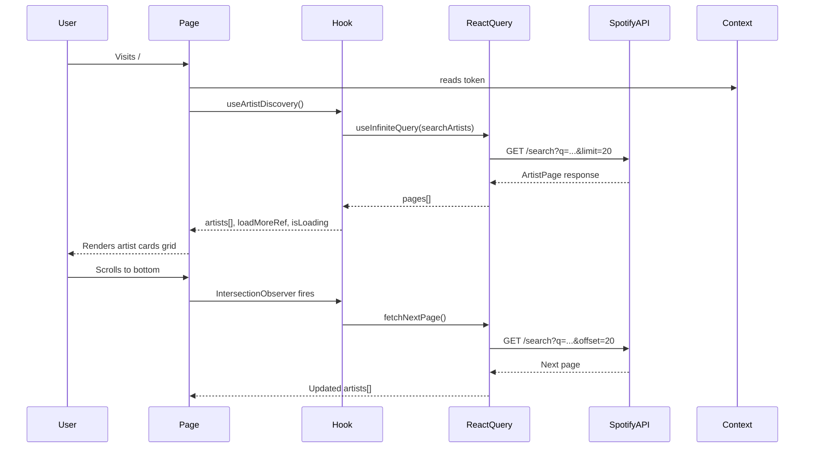

# Kanastra Frontend Hiring Challenge — Master Spec

## Overview

A single-page application that consumes the **Spotify Web API** to list artists, perform searches, and display artist details. The UI follows a **Liquid Glass** aesthetic (glassmorphism — blurs, transparencies, fluid elements). The project is evaluated on code clarity, architecture decisions, and how well the mandatory stack is applied.

## Tech Stack (Mandatory)

| Concern | Technology |
| --- | --- |
| Core | React 19 + TypeScript |
| Build | Vite |
| State Management | Context API + `useReducer` |
| Data Fetching | React Query (`useInfiniteQuery` for artist list) + Axios |
| Styling | Tailwind CSS + Shadcn UI |
| Forms | React Hook Form + Zod |
| i18n | i18next — PT-BR and EN-US |
| Charts | Recharts |
| Icons | Lucide Icons |
| Routing | React Router v7 |
| Quality | ESLint, Prettier, Vitest (unit), Playwright (E2E) |

## Application Pages

Five pages map directly to the reference screens in `/screens/`:

| Screen file | Route | Page name |
| --- | --- | --- |
| `login.png` | `/login` | Login / Auth |
| `artist-discovery.png` | `/` (home) | Artist Discovery |
| `artist-profile.png` | `/artist/:id` | Artist Profile |
| `my-collection.png` | `/collection` | My Collection (Favorites) |
| `insights-dashboard.png` | `/insights` | Insights Dashboard |

## Folder Structure

Follows the convention defined in `.claude/commands/folder-structure.md` exactly:

```
src/
├── main.tsx
├── Providers.tsx
├── api/
│   ├── mocks/spotify/
│   └── services/spotify/
│       ├── api.ts              ← Axios instance + interceptors
│       ├── get-artists.ts
│       ├── search-artists.ts
│       ├── get-artist.ts
│       ├── get-artist-top-tracks.ts
│       └── get-artist-albums.ts
├── assets/
├── components/
│   ├── ui/                     ← Shadcn primitives
│   ├── layout/                 ← Navbar, Sidebar, PageWrapper
│   └── ProtectedRoute.tsx
├── config/
│   ├── env.ts                  ← ENV object (VITE_ vars)
│   └── http.ts                 ← Axios spotify instance
├── contexts/
│   ├── AppContext.tsx           ← useReducer global state
│   └── FavoritesContext.tsx    ← Favorites state + localStorage
├── hooks/
│   └── use-local-storage.ts
├── langs/
│   ├── i18n.ts
│   ├── resources.ts
│   ├── en-US.json
│   └── pt-BR.json
├── lib/
│   └── utils.ts                ← cn() helper
├── pages/
│   ├── login/
│   ├── artist-discovery/
│   ├── artist-profile/
│   ├── my-collection/
│   └── insights/
├── routes/
│   └── router.tsx
├── styles/
│   ├── index.css               ← Tailwind + design tokens
│   └── glass.css               ← Liquid Glass CSS variables
├── types/
│   └── spotify.ts              ← Shared Spotify API types
└── utils/
    └── storage.ts
```

## Spotify API Integration

### Authentication

The Spotify Web API requires OAuth 2.0. For this challenge the **Client Credentials Flow** is used (server-side token, no user login required for public data). The token is fetched once and stored in the app state via `AppContext`.

> Note: If the evaluators require a real user login (to access personalized endpoints), the Login page implements the Authorization Code with PKCE flow instead.

### Axios Instance (`src/api/services/spotify/api.ts`)

- `baseURL`: `https://api.spotify.com/v1`
- Request interceptor: injects `Authorization: Bearer <token>` from `AppContext`
- Response interceptor: handles 401 (token refresh) and 400 errors with toast
- Mock flag: `USE_SPOTIFY_MOCK` — set to `true` during development

### Endpoints Used

| Function | Method | Endpoint |
| --- | --- | --- |
| `searchArtists` | GET | `/search?type=artist&q={query}&limit=20&offset={n}` |
| `getArtist` | GET | `/artists/{id}` |
| `getArtistTopTracks` | GET | `/artists/{id}/top-tracks` |
| `getArtistAlbums` | GET | `/artists/{id}/albums?limit=20&offset={n}` |
| `getRelatedArtists` | GET | `/artists/{id}/related-artists` |

All response schemas are validated with **Zod** at runtime. Types are derived via `z.infer`.

## State Management — Context API + useReducer

### `AppContext` (Global)

Manages: authentication token, current language, theme (light/dark), loading states.

```
State shape:
  token: string | null
  language: 'enUS' | 'ptBR'
  theme: 'light' | 'dark'
  isAuthLoading: boolean
```

Actions: `SET_TOKEN`, `SET_LANGUAGE`, `SET_THEME`, `SET_AUTH_LOADING`

### `FavoritesContext`

Manages: list of favorite tracks saved to `localStorage`.

Actions: `ADD_FAVORITE`, `REMOVE_FAVORITE`, `LOAD_FAVORITES`

Persistence: on every state change, the reducer result is synced to `localStorage` via a `useEffect` in the Provider.

## Functional Requirements

### 1. Artist Discovery (Infinite Scroll)

- Default view: loads a curated set of artists (e.g., search for a broad genre term)
- Search bar filters by artist name; album filter narrows results further
- `useInfiniteQuery` with `pageSize: 20`; next page triggered by `IntersectionObserver` on a sentinel `div`
- **No tables** — artists rendered as **cards** in a responsive grid
- Each card shows: artist image, name, genres, followers, popularity bar

### 2. Search & Filters

- Debounced text input (300 ms) for artist name search
- Secondary filter for album name (client-side filter on loaded data or separate API call)
- Filter state lives in the page hook (`useArtistDiscovery`)

### 3. Artist Profile (Details Page)

- Route: `/artist/:id`
- Shows: hero image, name, genres, followers, popularity
- Tabbed section: **Top Tracks** | **Albums**
- Each tab renders a **paginated table** (Shadcn `Table` component)
- Top Tracks table columns: #, Title, Album, Duration, Actions (add to favorites)
- Albums table columns: Cover, Title, Type, Release Date, Tracks

### 4. My Collection (Favorites)

- Route: `/collection`
- Lists all favorited tracks from `localStorage`
- **Add Favorite Form**: React Hook Form + Zod — fields: Track Name, Artist, Album, Notes (optional)
- Validation: Track Name and Artist are required (min 2 chars)
- Remove favorite action with confirmation
- Data persisted in `localStorage` via `FavoritesContext`

### 5. Insights Dashboard

- Route: `/insights`
- At least one functional **Recharts** chart
- Suggested charts:
  - Bar chart: Top 10 artists by followers
  - Radar chart: Popularity vs. Followers for searched artists
  - Pie chart: Genre distribution of favorited tracks
- Data sourced from the current search results and favorites stored in context

## Branding & Identity

### Logo

The project logo is a **cheese wedge with Spotify signal waves embossed on it** — a playful, original mark that fuses food culture with music streaming. The logo image lives at `src/assets/logo.png` (copied from the provided attachment). It is used in:

- The Navbar (left side, ~36px height)
- The Login page card (centered, ~72px height)
- The browser tab favicon (via `public/favicon.png`)

### App Name

**KanaPlay** — displayed next to the logo in the Navbar.

### Primary Brand Color — Yellow Ochre

All accent colors previously using Spotify green (`#1db954`) are replaced with **Yellow Ochre** as the primary brand color:

| Token | Value | Usage |
| --- | --- | --- |
| `--brand` | `#C8922A` | Primary CTA buttons, active nav links, accent fills |
| `--brand-light` | `#E8B84B` | Hover states, highlights, chart fills |
| `--brand-dark` | `#9A6E1A` | Pressed states, borders on brand elements |
| `--brand-muted` | `rgba(200, 146, 42, 0.15)` | Glass card tints, badge backgrounds |
| `--brand-border` | `rgba(200, 146, 42, 0.35)` | Borders on brand-tinted elements |

## Visual Design — Liquid Glass Aesthetic

### Design Tokens (CSS Variables)

```css
/* Defined in src/styles/glass.css */
--glass-bg: rgba(255, 255, 255, 0.08);
--glass-border: rgba(255, 255, 255, 0.18);
--glass-blur: blur(20px);
--glass-shadow: 0 8px 32px rgba(0, 0, 0, 0.37);
--glass-radius: 16px;

/* Brand — Yellow Ochre */
--brand: #C8922A;
--brand-light: #E8B84B;
--brand-dark: #9A6E1A;
--brand-muted: rgba(200, 146, 42, 0.15);
--brand-border: rgba(200, 146, 42, 0.35);
```

### Tailwind Utility Classes (custom)

Added via `tailwind.config.ts` plugin:

- `glass` — applies `--glass-bg`, `backdrop-blur`, `border --glass-border`, `rounded-[--glass-radius]`
- `glass-card` — `glass` + `--glass-shadow`
- `glass-input` — transparent input with glass border
- `btn-brand` — background `--brand`, text dark, hover `--brand-light`
- `accent-brand` — color `--brand`

### Background

Full-viewport dark gradient background (deep warm brown → dark charcoal → near-black) with animated floating blobs in ochre/amber tones using CSS `@keyframes`. The palette shifts from the previous purple/blue to warm dark tones that complement the yellow ochre brand.

## Internationalization

All UI strings go through `t('key')` — no hardcoded strings in JSX. Translation files:

- `src/langs/en-US.json` — English (default)
- `src/langs/pt-BR.json` — Portuguese

Language switcher in the Navbar calls `i18n.changeLanguage('ptBR' | 'enUS')`.

Key namespaces: `common`, `nav`, `artistDiscovery`, `artistProfile`, `collection`, `insights`, `login`

## Routing Architecture

```
/login              → Login (public)
/                   → ProtectedRoute
  /                 → ArtistDiscovery
  /artist/:id       → ArtistProfile
  /collection       → MyCollection
  /insights         → Insights
```

`ProtectedRoute` reads `AppContext` — if no token, redirects to `/login`.

## Data Flow Diagram



## Quality & Testing

- **ESLint**: extended config with `typescript-eslint` strict rules + `eslint-plugin-react-hooks`
- **Prettier**: `prettier.config.js` at root
- **Unit tests** (Vitest + React Testing Library): hooks and utility functions
- **E2E tests** (Playwright): critical flows — login, artist search, add favorite

## Wireframes

> Wireframes faithfully replicate the reference screenshots in `/screens/`. Yellow Ochre palette (`#C8922A` / `#E8B84B`), warm dark background, cheese-wedge logo, fixed player bar pinned to the footer.

### Login Page

Centered glass card on a warm dark gradient background with animated ochre blobs. The card contains: the cheese-wedge logo (72px) at the top, the **KanaPlay** title, and the subtitle "Curated discovery starts here." Below are two stacked fields — an **EMAIL** field with an envelope icon and a **PASSWORD** field with a lock icon and an eye toggle to reveal the value. A row beneath holds a "Remember me" checkbox on the left and a "Forgot Password?" link on the right. A full-width ochre gradient "Log In →" button follows, then a "Don't have an account? Sign Up" link. A copyright footer sits below the card, outside it.

### Artist Discovery Page

A dark navbar runs across the top: cheese-wedge logo + **KanaPlay** on the left, centered nav links (Discover active / Browse / Radio), and a search icon + avatar on the right. Below is a full-width hero banner with a concert photo and dark gradient overlay, showing a "TRENDING NOW" ochre badge with an animated dot, a large artist title, a description paragraph, and action buttons — a "▶ Listen Now" ochre gradient button plus a circular heart button. The content area below uses two columns: the left "Featured Artists" section holds three square artist cards (image + name + genre), and the right "Top Picks For You" column lists three track rows, each with a thumbnail, track name, artist, and a circular "+" button. A fixed player bar is pinned to the footer with a track thumbnail + name/artist + heart on the left, centered transport controls (shuffle, previous, play, next, repeat) with a progress bar, and mic/queue/volume controls on the right.

### Artist Profile Page

Same navbar as Discovery. A full-width hero uses the artist photo as a blurred, dark-overlaid background, centered, with a "VERIFIED ARTIST" badge (ochre dot), the artist name rendered large (48px+) in `#E8B84B`, and a row of stat pills (Monthly Listeners and Followers with icons). Centered action buttons follow: a circular ochre play button, an outline "Follow" button, and a ghost "…" button. Below the hero is a two-column layout: the left "Top Tracks" column is a numbered list (number, thumbnail, track name + artist, play count, duration; a favorited row shows an ochre heart) ending in a "See More ↓" link. The right column holds an "About the Artist" card (large stat such as "4.2M Monthly Listeners", truncated bio text, and a "Read Full Bio" link) followed by "Fans Also Like" with three circular avatars and names. A fixed player bar sits at the footer.

### My Collection Page

Same navbar, with "My Collection" active (ochre underline). A left sidebar labeled "YOUR LIBRARY" lists Liked Songs (active, with an ochre heart icon), Artists, Albums, and Playlists, with a "+ New Playlist" button pinned to the sidebar's bottom. The main area shows the "Liked Songs" title with a track count ("342 Tracks") and a "⇄ Shuffle All" ochre gradient button on the right. Below is a four-column grid of album/playlist cards, each with a square cover, name, and artist. A fixed player bar is pinned to the footer.

### Insights Dashboard Page

Same navbar, with "Insights" active (ochre underline). A left sidebar labeled "YOUR INSIGHTS" lists Overview (active), History, Top Charts, and Global Stats, with a "⬇ Export Report" button pinned to the bottom. The main area shows the "Insights Dashboard" title with the subtitle "📊 Your listening habits analyzed" and period filter pills (Week / Month active / Year) on the right. A two-column chart grid follows: a "Listening Trends" LineChart (a solid ochre "This Month" line and a dashed white "Last Month" line, x-axis Week 1–4, y-axis 15–45, legend above) and a "Monthly Favorites" donut PieChart (segments Synthwave `#C8922A`, Electronic `#4a90d9`, Ambient `#7c3aed`, Lofi `#27ae60`, with a side legend and a dark center hole). Below the charts are three stat cards in a row: Hours Played "128.5" with a "+12%" green delta, New Artists "24" with an "↑5" green delta, and Top Genre "Synthwave" in `#E8B84B`. A fixed player bar is pinned to the footer.

## Acceptance Criteria Summary

- All 5 pages implemented and routed correctly
- Spotify API integrated with Axios + Zod validation on all responses
- `useInfiniteQuery` with 20-item pages and IntersectionObserver scroll trigger
- No tables on the Artist Discovery page (card grid only)
- Artist Profile has paginated table for Top Tracks and Albums
- Favorites form uses React Hook Form + Zod with proper validation
- Favorites persisted to localStorage via FavoritesContext + useReducer
- At least one functional Recharts chart on Insights page
- All UI strings use `t()` from i18next (PT-BR + EN-US)
- AppContext uses useReducer for global state
- Liquid Glass visual style applied consistently
- ESLint + Prettier configured
- Unit and E2E test setup in place
